# 从权限管理到编译原理

> 本文共 预计阅读时间 15分钟+

大家好我是 `GaoNeng-wWw`. 前几天在用Nest.js写SSO后端的时候涉及到一些复杂的权限管理. 例如 `如果有 A 和 B 权限 或 有 A 和 C 权限` 那么则允许访问. 解决方案是写一个修饰器, 接受一个对象, 用于描述权限表达式, 类似于AST. 该修饰器作用于接口, 启动时为成员设置元信息, 接收到请求后 Guard 反射读取表达式对象, 而后调用 `judge` 函数判断用户是否满足该表达式。

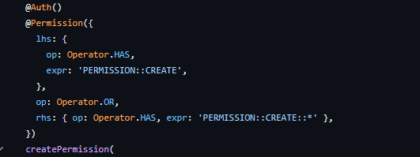

考虑到后面可能会接入更多的权限, 为了保护开发人员的大脑和个人安全, 不得不含泪搓了一个普拉特解析器。

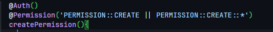

这样一来, 开发人员的心智不仅得到了保护, 就连自己的个人安全也得到了保证。等写完后端后，便将该功能迁移到了前端。

阅读完本文, 你将能够有以下的收获

1. `v-permission` 的封装
2. 如何写一个 Pratt 解析器
3. 如何写一个简单的Vite插件

文中所有的代码(包括课后习题答案)都可以在 [Permission-Compiler](https://github.com/GaoNeng-wWw/permission-compiler)中找到.

## 封装一个完备的 v-permission

在这里, 当我们讨论 `完备` 的时候, 实际上我们在讨论能不能满足基本逻辑运算. 即: 与、或、非。

如果单单的使用数组来表示很难做到表达基本的逻辑运算. 所以我们可以使用一个或多个的对象组合而成. 下面的代码块则是一个完备的 PermissionExpression.

```ts
type And = {
  lhs: PermissionExpr;
  rhs: PermissionExpr;
  type: 'AND';
}
type Or = {
  lhs: PermissionExpr;
  rhs: PermissionExpr;
  type: 'OR';
}
type Not = {
  expr: PermissionExpr;
  type: 'NOT';
}
type Has = {
  val: string;
  type: 'HAS'
}
type PermissionExpr = Has | And | Or | Not;
```

这样我们就定义了一个完备的权限表达式对象. 其中 `And`, `Or`, `Not` 对应的是与或非. `Has` 类型表示的是, 某个用户是否拥有某个权限.

当且仅当用户存在权限 `a` 时候 `{type: 'Has', val: 'a'}` 会为true.

有了上述的类型，我们便可以封装一个较为完备的 v-permission 了

```ts
// directive/v-permission.ts
export default {
  created: (el: Element, binding)=>{
    if (!isValid(binding.value)){
      el.innerHTML = '<!-- -->'
    }
  },
} as Directive<Element, PermissionExpr>;
```

对于 `isValid` 函数, 实现起来也非常容易。因为 `PermissionExpr` 本质就是一颗树。所以我们可以很轻松的给出 `isValid` 的实现

```ts
const judge = (expr: PermissionExpr, userPermission: string[]):boolean => {
  if (expr.type === 'HAS') {
    return userPermission.includes(expr.val);
  }
  if (expr.type === 'AND'){
    return judge(expr.lhs, userPermission) && judge(expr.rhs, userPermission);
  }
  if (expr.type === 'OR') {
    return judge(expr.lhs, userPermission) || judge(expr.rhs, userPermission);
  }
  if (expr.type === 'NOT'){
    return !judge(expr.expr, userPermission);
  }
  return false;
}

const isValid = (node:PermissionExpr) => {
  const { permissions } = useAccount();
  return judge(node);
}
```

回到我们的 vue 文件中. 我们可以直接定义权限表达式看一下效果, 如果没问题，应该显示 `完 全 勝 利` 四个字

```html
<!-- App.vue -->
<script lang="ts" setup>
import vPermission from './directive/v-permission';
</script>
<template>
  <span v-permission="{type: 'HAS', val: 'a'}">完 全 勝 利</span>
</template>
```

```ts
// mock-store.ts
import { ref, type Ref } from "vue"

const permissions:Ref<string[]> = ref(['a']);

export const useAccount = () => {
  const add = (permission: string) => {
    permissions.value.push(permission);
  }
  const remove = (permission: string) => {
    permissions.value = permissions.value.filter(p => p === permission);
  }
  const has = (permission: string) => permissions.value.some(p => p === permission);
  return { add, remove, has, permissions };
}
```


<center style="font-weight: bold;"><del style="color: red;">完 全 勝 利</del></center>

## 表达式解析

对于复杂的权限, 手写表达式对象显然不太现实. 所以我们可以传入一个字符串, 编译时将该字符串解析为一个表达式对象, 权限判断依然留在运行时. 流程图大概如下

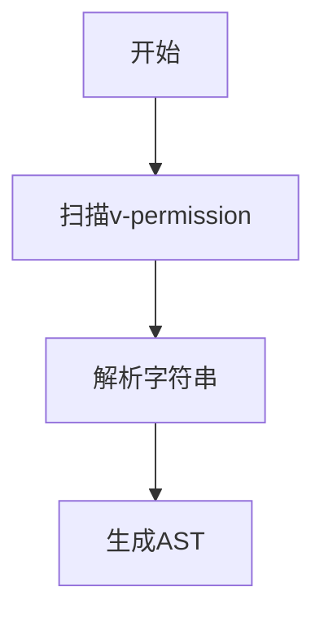

## 编译流程

将某一种程序设计语言写的程序翻译成等价的另一种语言的程序的程序. 某种意义上, 我们将字符串编译权限表达式对象这个过程也可以称作为编译。

我们都知道, 语言分为: 编译型语言、解释性语言。二者最本质的不同便是 **编译型语言会将源代码转为机器语言.**

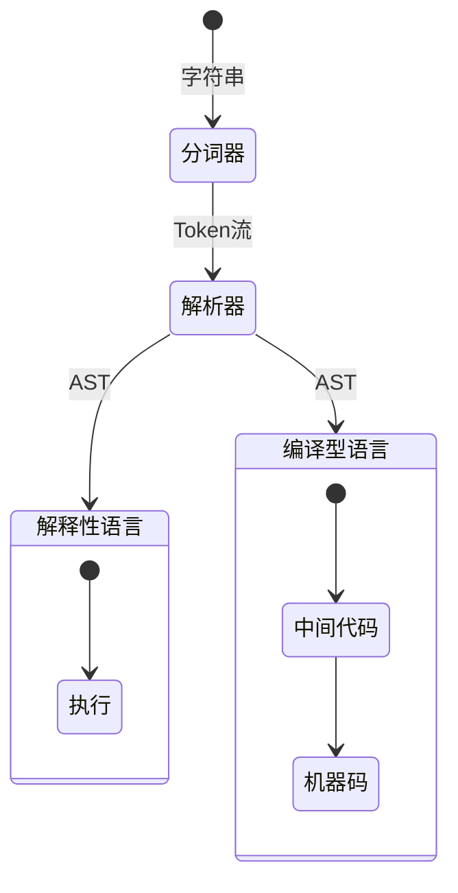

无论是解释性语言还是编译型语言, 整体都需要将用户输入的字符串信息分割为Token, 而后将Token组合为AST。

### 形式语言

在形式语言理论中，文法（formal grammar)是形式语言中字符串的一套产生式规则（production rule）。这些规则描述了如何用语言的字母表生成符合句法(syntax)的有效的字符串

### 形式语言语法

产生是的规则。正式定义为 $G=(N,\Sigma,P,S)$

- $N$ 是有限的非终结符集合，与$G$生成的字符串无交, 换句话说 $N \cap G = \emptyset $
- $\Sigma$ 是有限的终结符集合, $\Sigma \cap N = \emptyset$
- $P$ 是产生式规则集合 $(\Sigma \cup N)^{*}N(\Sigma \cup N)^* \rightarrow (\Sigma \cup N)^{*}$
- $S$ 是开始符号 $S \in N$

其中 \* 为 [克莱尼星号](https://zh.wikipedia.org/wiki/%E5%85%8B%E8%8E%B1%E5%B0%BC%E6%98%9F%E5%8F%B7)

### 产生式

语法是由产生式规定。它规定了那些符号可以替换为哪些符号. 例如 $X \rightarrow Z$ 表示, 符号 $X$ 可以被替换为 $Z$。读作 $X$ 可以重写/替换为 $Z$

### 终结符与非终结符

终结符是在产生式中不能被分解为更小单位的的基本符号。例如

$$
x \rightarrow a \\
a \rightarrow b
$$

其中$b$是一个终结符, 因为$b$不会再推导出任何的符号. 但$a$, $x$ 都是非终结符, 因为 $a$ 可以推导出 $b$， $x$ 可以推导出 $a$

### 上下文无关文法

是一种形式化、精确描述语言语法的工具. 在应用一个产生式进行推到时,前后推导的结果就是上下文.

倘若有一个文法 $G$, 文法中每一个产生式左侧的非终结符是单独出现的, 那么我们可以说这个文法是上下文无关文法.

例如

$$
\begin{matrix}
  S1 & \rightarrow S & V & O \\
  S  & \rightarrow 你 & 我 & 小明 \\
  V  & \rightarrow 吃 & 喝 & 玩 \\
  O  & \rightarrow 猪肉 & 鸡肉 & 羊肉\\
\end{matrix}
$$

那么 $S1$ 组成的集合就是 $S1=\{你吃猪肉,你吃鸡肉,你吃羊肉,你喝猪肉,...小明玩鸡肉\}$ [$^{[^1]}$](#ref)

~~虽然推导出来的句子挺鬼畜的, 但至少意思到了~~

### 上下文有关文法

任何产生式规则的左手端和右手端都可以被终结符和非终结符构成的上下文所围绕。

例如

$$
\begin{matrix}
  S1 & \rightarrow S & V & O \\
  S  & \rightarrow 你 & 我 & 小明 \\
  V  & \rightarrow 吃 & 喝 & 玩 \\
  O  & \rightarrow 猪肉 & 鸡肉 & 羊肉\\
  玩O  & \rightarrow 手机 \\
\end{matrix}
$$

这样一来推导过程就是 $S1 \rightarrow SVO \rightarrow 你VO \rightarrow 你玩O \rightarrow 你玩手机$


## 词法分析

分词器主要将用户输入的字符串转为一个个Token. 这个过程叫做 Tokenization. (说真的我不知道这个怎么翻译, 就理解为标记化吧). 该阶段被称之为词法分析阶段.

词法分析阶段并不关注Token之间的关系。 例如 `(()` 可以通过词法阶段, 但不一定能通过语法分析阶段.

例如对于下列 JavaScript 代码

```js
const a = 1;
```

可以标记化为

| Token | TokenKind |
| :---: | :-------: |
| const | 常量关键词  |
| a     | 标识符     |
| =     | 等号       |
| 1     | 数字常量   |
| ;     |  分号      |

### 词法分析器

写一个词法分析器其实并不困难, 我们并不需要逐字符的去遍历然后拼接，而是可以使用更加高效的正则表达式完成. 因为我们的词法分析器目的是为了生成Token, 所以我们应该先设定Token的类型

```ts

enum TokenKind {
  EOF,
  IDENTIFIER,
  LEFT_PARENTHESIS,
  RIGHT_PARENTHESIS,
  AND,
  OR,
  NOT,
}

type Token = {
  // Token类型
  kind: TokenKind;
  // 人类可读的类型, TokenKind[kind]
  humanKind: string;
  // 实际字符
  char: string;
}
```

有了Token类型我们就可以来设计分词器了.

```ts
type RuleHandle = (
  args: {
    tokens: Token[];
    match: string;
    advanceN: (val: number)=>void
  }
) => void;

type Rule = [RegExp, RuleHandle]

export const tokenizer = (
  code: string.
  rule: Rule[]
): Token[] => {}
```

上述代码中, rule参数可能比较难理解. 这么做的原因主要是为了扩展性考虑, 用户可以通过传入rule参数来直接个性化的定制分词逻辑.

接下来我们就要开始写分词器了. 事实上整个分词器非常简单, 分词器一共三种情况

1. 到达末尾了
   1. 为Token流插入 EOF Token
2. 没有到达末尾, 没有通过任何一个正则表达式
   1. 行为: 抛出错误, `Bad Input ${code}`
3. 没有达到末尾, 通过了至少一个正则表达式
   1. 调用指定规则的 handle 

```ts
// directive/permission-lexer.ts
export const tokenizer = (
  code: string.
  rule: Rule[]
): Token[] => {
  const tokens: Token[] = [];
  let input = code;
  let pos = 0;
  let matched = false;
  const isEnd = () => pos < input.length;
  const advanceN = (val: number) => {
    pos += val;
  }
  // 消耗掉 [0,pos) 的字符串
  // 换句话说 丢弃 [0,pos) 这个区间
  const reminder = () => input.slice(pos);
  while (!isEnd()) {
    for (const [regExp, handle] of rules) {
      if (regExp.test(input)){
        matched = true;
      }
      const match = regExpr.exec(reminder());
      if (!match) {
        // 这个地方纯粹是为了避免as强转
        // 如果有需要可以抛出错误而不是continue
        continue;
      }
      handle({tokens, match: match[0] })
    }
    if (!matched) {
      throw new Error(`Bad Input ${input}`);
    }
  }
  tokens.push({kind: TokenKind.EOF, humanKind: 'EOF', char: '0'});
  return tokens;
}

const defaultHandle = (kind: TokenKind)=>{
  return (({tokens, advanceN, match}) => {
    tokens.push({kind, char: match, humanKind: TokenKind[kind]});
    advanceN(match.length)
  }) as RuleHandle;
}
const skip:RuleHandle = ({match,advanceN}) => {
  advanceN(match.length);
}
export const rules: Rule[] = [
  [/^\ /, skip],
  [/^And|^&&|^AND|^\&/, defaultHandle(TokenKind.AND)],
  [/^Or|^\|\||^OR|^\|/, defaultHandle(TokenKind.OR)],
  [/^Not|^!|^NOT/, defaultHandle(TokenKind.NOT)],
  [/^\(/, defaultHandle(TokenKind.LEFT_PARENTHESIS)],
  [/^\)/, defaultHandle(TokenKind.RIGHT_PARENTHESIS)],
  [/^,/, defaultHandle(TokenKind.COMMA)],
  [/^[a-zA-Z_][a-zA-Z0-9_]*/, defaultHandle(TokenKind.IDENTIFIER)]
]

```

注意, 这里的正则表达式全部都是 `/^..../` 而不是 `/.../`. 我们修改下代码来看看效果

```diff
// directive/v-permission.ts
+ import {rules, tokenizer} from './permission-lexer.ts';
- const isValid = (node:PermissionExpr) => {
+ const isValid = (node:PermissionExpr | string) => {
     const { permissions } = useAccount();
-    return judge(node);
+    if (typeof node === 'string') {
+      const tokens = tokenizer(node, rules);
+      console.log(tokens);
+      return true;
+    } else {
+      return judge(node);
+    }
}

export default {
  created: (el: Element, binding)=>{
    if (!isValid(binding.value)){
      el.innerHTML = '<!-- -->'
    }
  },
-} as Directive<Element, PermissionExpr>;
+} as Directive<Element, string | PermissionExpr>
```

```diff
//App.vue
<script lang="ts" setup>
import vPermission from './directive/v-permission';
</script>


<template>
-  <span v-permission="{type: 'HAS', val: 'a'}">完 全 勝 利</span>
+  <span v-permission="'a || b'">完 全 勝 利</span>
</template>
```

修改完成后, 在控制台中我们应该能够看到下图

<center>
  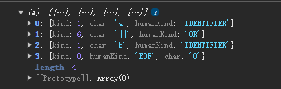
</center>

## 语法分析

语法分析阶段的任务是接受来自词法分析阶段的Token流, 根据语法规则来建立语法树。本文采用的是普拉特解析法(Pratt Parser). Pratt Parser可以很有效的解析中缀表达式和优先级。不仅如此，Pratt Parser也更加灵活(后文中你会看到Pratt Parser到底有多灵活)

### Nud, Led

Nud (**T**he **N**ull **D**enotation), 如果一个Token可以放在开头, 那么我们称这个Token叫做Nud (非严格定义的话可以叫做prefix). 例如一元运算 (-, !, ~)

Led (**T**he **L**eft **D**enotation), 如果一个Token**必须**知道左边的表达式，那么我们称它是一个Led (非严格定义的话可以叫infix). 例如二元运算符 (&&, ||, +-*/)

不过我们要注意, 有些Token可以是 Nud 也可以是 Led. 比如说当 「-」

### 基础结构

Pratt基础结构非常简单, 核心不会超出30行代码

```ts
// v-permission/permission-parser.ts
export const enum BP {
  DEFAULT_BP,
  COMMA,
  LOGICAL,
  UNARY,
  PRIMARY
}
type LedHandle = (lhs: Expr, bp:BP) => Node;
type NudHandle = () => Node;
export class Parser {
      constructor(
        private tokens: Token[]=[],
        private pos=0,
        private nudMap = new Map<TokenKind, NudHandle>(),
        private ledMap = new Map<TokenKind, LedHandle>(),
        private bpMap=new Map<TokenKind, BP>()
      ){
        this.setup();
      }
/*01*/parseExpr(bp: number){
/*02*/  const token = this.peek();
/*03*/  const tokenKind = token.kind;
/*  */  // 从nud开始
/*04*/  const nud = this.nudMap.get(tokenKind);
/*05*/  if (!nud) {
/*06*/    throw new Error(`Except token ${TokenKind[token.kind]}`);
/*07*/  }
/*08*/  let lhs = nud();
/*09*/  while (
/*10*/    this.bpMap.get(this.peek().kind) !== undefined && 
          // bp实际上是限制了led解析
          // 换句话说我们只解析比当前token绑定力更大的token
          // 比如 -1*2
          // 假设我们给 「-」 设定绑定力为3, 「*」的绑定力为2
          // 1就会和「-」绑定而不是「*」
/*11*/    this.bpMap.get(this.peek().kind)! > bp
/*12*/  ) {
/*13*/    const cur = this.peek();
/*14*/    const tk = cur.kind;
/*15*/    const led = this.ledMap.get(tk);
/*16*/    if(!led){
/*17*/      throw new Error(`Except for token ${cur.humanKind}`);
/*18*/    }
/*19*/    lhs = led(lhs, bp);
/*20*/  }
/*21*/  return lhs;
/*22*/}
/*23*/peek(){
/*24*/  return this.tokens[this.pos]
/*25*/}
      setup(){}
}
```

### `Identifier` 与 二元表达式 的解析

在上文中我们说过 `Pratt Parser` 的扩展能力非常强. 接下来让我们完善Identifier的解析.

首先我们来定义一下`Identifier`的类型

```ts
export type Expr = BinaryExpr | Identifier;
export interface Identifier {
  type: 'Identifier',
  name: string;
}
export interface BinaryExpr {
  type: 'BinaryExpr',
  operator: Token;
  // 因为二元表达式允许符号左右两侧都是子表达式
  // [1,2,3].every(val => typeof val === 'number') && [1,2,3].some(val => val % 2 === 0)
  // 上述代码显然是合法的
  lhs: Expr; 
  rhs: Expr;
}
```

之后我们需要实现几个函数

- `next`: 获取当前token, 向前步进一个token
  - 换句话说就是吃掉当前token, 然后返回吃掉的token
- `nud`
  - 注册 `Nud` Token的处理函数和绑定力
- `led`
  - 注册 `Led` Token的处理函数和绑定力
- `setup`
  - 初始化一些处理函数, callback需要显式调用 `bind` 函数声明this指向.

```ts
next(){
  const token = this.peek();
  this.pos += 1;
  return token;
}
nud(kind: TokenKind, f: NudHandle){
  this.bpMap.set(kind, BP.PRIMARY);
  this.nudMap.set(kind, f);
}
led(bp: BP, kind: TokenKind, f: LedHandle) {
  this.bpMap.set(kind, bp);
  this.ledMap.set(kind, f);
}
setup(){
  // 待会实现
}
```

有了工具函数接下来我们先实现最简单的 `Identifier` 解析

```ts
/*01*/ parsePrimary(){
/*02*/   const name = this.next().char;
/*03*/   return {
/*04*/     type: 'Identifier',
/*05*/     name,
/*06*/   } as Identifier;
/*07*/ }
/*08*/ parseBinary(lhs: Expr){
/*09*/   const operator = this.next();
/*10*/   const rhs = this.parseExpr(BP.LOGICAL);
/*11*/   return {
/*12*/     type: 'BinaryExpr',
/*13*/     lhs,
/*14*/     rhs,
/*15*/     operator,
/*16*/   } as BinaryExpr;
/*17*/ }
/*18*/ setup(){
/*19*/   this.led(BP.LOGICAL,TokenKind.AND,this.parseBinary.bind(this) );
/*20*/   this.led(BP.LOGICAL,TokenKind.OR,this.parseBinary.bind(this) );
/*21*/   this.nud(TokenKind.IDENTIFIER,this.parsePrimary.bind(this) );
/*22*/ }
```

好了, 追加完上述22行代码后我们就完成了对Identifier和二元表达式的解析. 接下来我们稍微的修改一下代码

```diff
// v-permission.ts
+ import {rules, tokenizer} from './permission-lexer.ts';
+ import {Parser} from './permission-parser.ts';
- const isValid = (node:PermissionExpr) => {
+ const isValid = (node:PermissionExpr | string) => {
     const { permissions } = useAccount();
+    if (typeof node === 'string') {
+      const tokens = tokenizer(node, rules);
-      console.log(tokens);
+      const parser = new Parser(tokens);
+      const ast = parser.run();
+      console.log(ast);
+      return true;
+    } else {
+      return judge(node);
+    }
// App.vue

<template>
  <span v-permission="'a || b'">完 全 勝 利</span>
</template>
```

修改完成后刷新一下页面, 理论上控制台应该输出

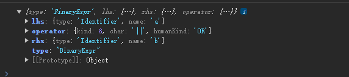

### 分组表达式

对于一元表达式和分组表达式, 实际上更加的简单. 因为我们不会(至少这篇文章不会)涉及到函数调用. 我们先来实现以下分组表达式, 分组表达式不需要定义类型.

解析器只需要吃掉左括号然后重新开始解析表达式就可以，解析完成后吃掉右括号，然后返回解析好的表达式。

```ts
// 获取当前 token 的 TokenKind. 如果不为我们预期, 则直接抛出错误
expect(kind: TokenKind) {
  const token = this.peek();
  if (token.kind !== kind) {
    throw new Error(`Expcetion ${TokenKind[kind]} but find ${TokenKind[token.kind]}`);
  }
  return this.next();
}
parseGroup(){
  // 吃掉左括号, 没有就报错
  this.expect(TokenKind.LEFT_PARENTHESIS);
  // 重新解析所有表达式
  const expr = this.parseExpr(BP.DEFAULT_BP);
  // 吃掉右括号, 没有就报错
  this.expect(TokenKind.RIGHT_PARENTHESIS);
  return expr;
}
setup(){
  // ...
  this.nud(TokenKind.LEFT_PARENTHESIS, this.parseGroup.bind(this));
}
```

接下来让我我们修改一下代码, 看一下分组表达式的结果

```diff
<span v-permission="'a || (b || c)'">完 全 勝 利</span>
```

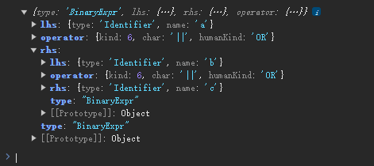

如果不加括号的话, 默认是左结合. 当解析器遇到左括号后会重新开始解析子表达式. 

### 前缀表达式的解析

前缀表达式是我们最终要解决的问题，当然他并不难，恰恰相反，反而是因为太简单了到最后随手就能实现. 先让我们来定义一下前缀表达式的类型

```ts
interface PrefixExpr {
  type: 'PrefixExpr';
  operator: Token;
  expr: Expr;
}
```

```ts
parsePrefix(){
  const operator = this.next();
  const expr = this.parseExpr(BP.UNARY);
  return {
    type:  'PrefixExpr',
    operator,
    expr
  } as PrefixExpr
}
setup(){
  // ...
  this.nud(TokenKind.NOT, this.parsePrefix.bind(this) );
}
```

现在让我们修改一下代码看一下效果

```diff
- <span v-permission="'a || (b || c)'">完 全 勝 利</span>
+ <span v-permission="'!a || (b || c)'">完 全 勝 利</span>
```

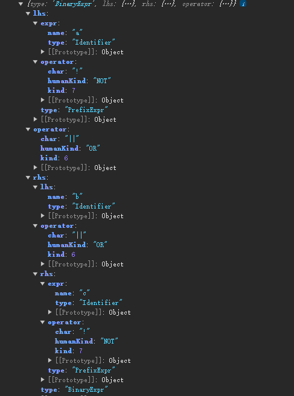

然后我们来完善一下类型

```ts
export type Node = Expr;
export type Expr = BinaryExpr | Identifier | PrefixExpr;
```

## 代码生成

本章节的目的在于将先前我们生成好的 `Expr` 转为我们 [封装一个完备的 v-permission](#封装一个完备的 v-permission) 中定义好的 `PermissionExpr`

```ts
const objectGenerate = (node:Node): PermissionExpr | null => {
  // ?
  return null;
}
```

`Identifier` 与 `Prefix` 都太简单了. 唯一有一点难度的只有 `BinaryExpression`. 所以我们这里只写 `BinaryExpression`. 对于其他 (包括[课后习题](#课后习题)) 都可以在 [Permission-Compiler](https://github.com/GaoNeng-wWw/permission-compiler)中找到

```ts
// directive/codegen.ts
const isPrefix = (node:Node) => node.type === 'PrefixExpr';
const isIdentifier = (node:Node) => node.type === 'Identifier';
const isBinaryExpr = (node:Node) => node.type === 'BinaryExpr';
export const binaryExprGen = (expr: BinaryExpr) => {
  const {lhs,rhs,operator} = expr;

  // 这里判断主要是为了收窄 operator.kind 只能是 AND 和 OR
  if (operator.kind !== TokenKind.AND && operator.kind !== TokenKind.OR) {
    throw new Error('Operator only support && or ||, or you can use keywords `and` or `or`.');
  }
  return {
    lhs: objectGenerate(lhs),
    rhs: objectGenerate(rhs),
    type: TokenKind[operator.kind]
  } as And | Or
}
export const objectGenerate = (node: Node):PermissionExpr|null => {
    if (isIdentifier(node)) {
    // ...
  }
  if (isBinaryExpr(node)){
    return binaryExprGen(node);
  }
  if (isPrefix(node)) {
    // ...
  }
  return null;
}
```

现在我们稍微的修改一下代码, 看看能不能生成 `PermissionExpr`

```diff
// v-permission.ts
+import { objectGenerate } from './codegen';
const isValid = (value: string | PermissionExpr) => {
  const { permissions } = useAccount();
  if (typeof value === 'string') {
    const parser = new Parser(tokens);
+   const ast = parser.run();
+   const permissionExpr = objectGenerate(ast);
+   if (!permissionExpr){
+     throw new Error('Unknown Error')
+   }
+   console.log(permissionExpr)
+   return judge(permissionExpr, permissions.value);

// App.vue
+ <span v-permission="'!a || (b || !c)'">完 全 勝 利</span>
```

刷新页面后我们应该在控制台看到

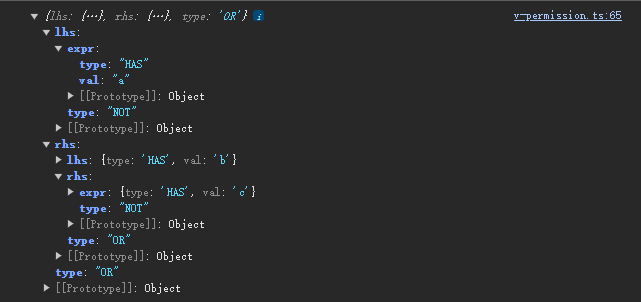

页面上应该也可以看到


这里之所以能看到是因为我们权限写的是 `没有A 或者 (B 或者 没有C)` 因为或运算符只要有一个是true, 则对应的表达式就是true. 我们在 `mock-store.ts` 中 `permissions` 变量写的是 `['a']`. 显然满足了 `!c`, 那么 `b || !c` 就是true, 那么 `!a || (b||!c)` 也是true, 那么就可以显示

## 插件

实际上整个文章到这里确实可以结束了, 因为我们完成了最终的目标 `输入一段字符串, 解析为权限表达式对象`.

但在这里我们可以稍作思考, 如果我们给 `v-permission` 传入一个静态的字符串, 那么其实没有必要在运行时进行解析, 而是可以直接在编译时进行解析, 使用解析产物替换掉传入的静态字符串.

所以我们的整体历程便是

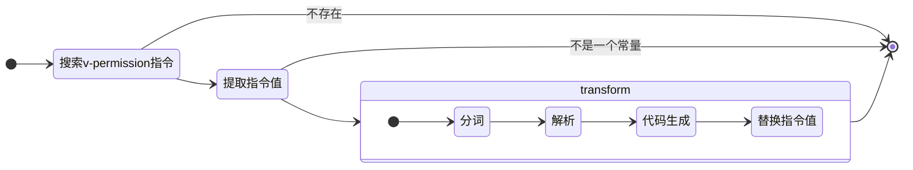

### 写个简单的插件

```ts
// plugin/permission.ts
import type {Plugin} from 'vite';
import permissionTransform from './permission-transform';

const permission = ()=>{
  return {
    name: 'vite-plugin-vue-permission',
    transform(code, id, options) {
      if (!id.endsWith('vue')){
        return code;
      }
      return permissionTransform(code, id);
    },
    enforce: 'pre',
  } as Plugin;
}

export default permission;

// vite.config.ts
import permission from './plugin/permission';
import inspect from 'vite-plugin-inspect';

// https://vite.dev/config/
export default defineConfig({
  plugins: [
    inspect(),
    vue(),
    permission()
  ],
})

```

### 实现 `permissionTransform`

考虑到我们编译器的主体结构已经实现, 所以 `permissionTransform` 的难度主要在于

1. 如何将vue代码转为ast
2. 如何将ast转为代码

第一个问题相对来说比较好解决, `vue` 官方提供了 `@vue/compiler-sfc` 来负责解析。

第二个问题似乎没有什么标准答案, 掘金上也有不少人是自己根据ast写了代码生成. 但个人感觉其实没有必要, 我们完全可以对 `loc.start.offset` 进行降序排序, 而后切分重组字符串。

#### 提取 v-permission

提取 `v-permission` 是最简单的一个部分, 本质就是遍历template下所有的dom元素, 提取后再提取存在 `name` 为 `permission` 的指令就可以。

```ts
// plugin/permission-transform.ts
export default (
  code: string, id:string
)=>{
  const sfcAST = useSFC({code,id});
  const elements:BaseElementNode[] = [];
  const template = sfcAST.template;
  if (!template?.ast) {
    return code;
  }
  walkSFC(template.ast, {
    enter: (node) => {
      if (node.type === NodeTypes.ELEMENT ) {
        const _node:BaseElementNode = node as BaseElementNode;
        elements.push(_node);
      }
    }
  })
  if (!elements.length) {
    return code;
  }
  const directives:DirectiveNode[] = [];
  for (const ele of elements) {
    const props = ele.props;
    const allDirectives = props.filter(p => p.type === NodeTypes.DIRECTIVE);
    if (!allDirectives.length){
      continue;
    }
    directives.push(...allDirectives.filter(d => d.name === 'permission'))
  }
  directives.sort((a,b) => b.loc.start.offset - a.loc.start.offset);
  return code;
}
```

#### 解析静态字符串

```ts
// plugin/permission-transform.ts
const parseStaticPermission = (
  _ast: SimpleExpressionNode
) => {
  const vueAST = _ast.ast;
  if (!vueAST){
    return ;
  }
  let text = '';
  if(vueAST.type === 'StringLiteral'){
    text = vueAST.value;
  }
  if (vueAST.type === 'TemplateLiteral') {
    throw new Error('Not implment Template parse yet.');
  }
  const tokens = tokenizer(text, rules);
  const parser = new Parser(tokens);
  const ast = parser.run();
  const expr = objectGenerate(ast);
  if (!expr) {
    throw new Error('Unknown Error');
  }
  return expr;
}
export default (
  code: string, id:string
)=>{
  // ...
  for (const directive of directives) {
    if (!directive.exp || !directive.exp.ast){
      continue;
    }
    if (directive.exp.type !== NodeTypes.SIMPLE_EXPRESSION){
      continue;
    }
    if (directive.exp.ast.type !== 'StringLiteral') {
      continue;
    }
    const permissionExprAstIR = parseStaticPermission(directive.exp);
    if (!permissionExprAstIR){
      continue;
    }
  }
}
```

前三个if拆开写纯粹是为了不让自己心智负担太大. 这边我们对 `objectGenerate` 产出的代码叫做了 `Intermediate language`. 

### 重组字符串

这里有一个小坑，我们需要对 `directive.exp.loc.start.offset` 进行倒序排序, 换句话说我们要倒着修改字符串. 如果不这么做, 就会陷入到 修改完第一个字符串结果第二个字符串的位置偏移了。

```diff
export default (
  code: string, id:string
)=>{
  // ...
  for (const directive of directives) {
    if (!directive.exp || !directive.exp.ast){
      continue;
    }
    if (directive.exp.type !== NodeTypes.SIMPLE_EXPRESSION){
      continue;
    }
    if (directive.exp.ast.type !== 'StringLiteral') {
      continue;
    }
    const permissionExprAstIR = parseStaticPermission(directive.exp);
    if (!permissionExprAstIR){
      continue;
    }
    const permissionExprAstIR = parseStaticPermission(directive.exp);
    if (!permissionExprAstIR){
      continue;
    }
+   const l = directive.exp.loc.start.offset;
+   const r = directive.exp.loc.end.offset;
+   code = `${code.slice(0,l-1)}"${JSON.stringify(permissionExprAstIR).replaceAll('"',"'")}"${code.slice(r+1)}`
  }
  return code;
}
```

### Try It

接下来, 我们就可以再 `vite.config.ts` 中使用我们的插件了.

```ts
// vite.config.ts
import { defineConfig } from 'vite'
import vue from '@vitejs/plugin-vue'
import permission from './plugin/permission';
import inspect from 'vite-plugin-inspect';

// https://vite.dev/config/
export default defineConfig({
  plugins: [
    inspect(),
    vue(),
    permission()
  ],
})
```

接下来我们修改下 `App.vue` 访问 `http://localhost:5173/__inspect`

```html
<!-- App.vue -->
<!-- 还是沿用了先前的App.vue -->
<script lang="ts" setup>
import vPermission from './directive/v-permission';
</script>

<template>
  <span v-permission="'!a || (b || !c)'">完 全 勝 利</span>
</template>
```

访问 `inspect` 之后, 我们点击 `App.vue` 后在弹出的 `Drawer` 中点击我们编写的插件, 可以看到确实已经替换成功了

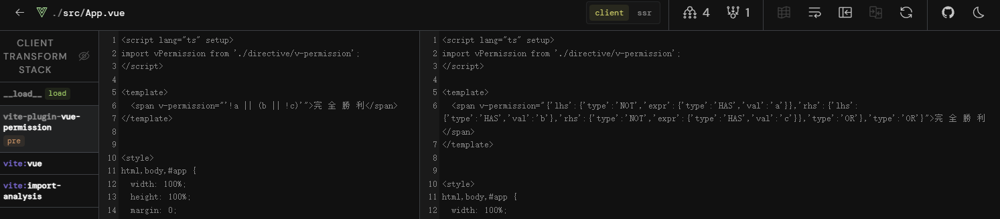

## 课后习题

- 实现函数解析

## Ref

1. https://www.zhihu.com/question/21833944/answer/307309365